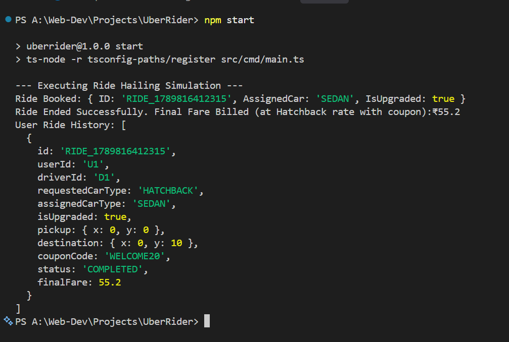

# Ride Hailing Backend Service

This project implements a backend orchestration system for a ride-hailing platform, designed with Domain-Driven Design (DDD) principles and tested using Jest.

## 1. Assumptions Made
*   **Geospatial Model:** Locations are represented as coordinates on a flat 2D Cartesian plane. Distances are calculated using standard Euclidean geometry rather than the Haversine formula for a spherical Earth.
*   **Ride Lifecycle:** A driver is considered exclusively locked to a single ride once assigned and cannot accept concurrent requests.
*   **Free Upgrade Economics:** If a user requests a Hatchback and is upgraded to a Sedan due to unavailability, the system strictly calculates the final fare based on the initially requested Hatchback pricing tiers, absorbing the upgrade cost.

## 2. Key Design Decisions and Trade-offs
*   **Domain-Driven Architecture:** I deliberately separated the domain entities, use-case logic, and repository layers. This isolates the core business rules from the in-memory storage implementation.
*   **Strategy Pattern for Extensibility:** The pricing engine (`PricingStrategy`) and driver discovery engine (`DriverMatchingStrategy`) are abstracted behind interfaces. This explicitly avoids hardcoding pricing tiers into the booking service, allowing for the seamless injection of new car types or surge pricing modifiers.
*   **Concurrency Handling:** To address the race condition of multiple users booking the same driver, I implemented an atomic boolean lock at the application level.
*   **Trade-off (In-Memory Storage):** Per the acceptable project constraints, I utilized Node.js `Map` objects for $O(1)$ data storage instead of provisioning an external database like PostgreSQL. The trade-off is a lack of persistence across application restarts, but it allows for rapid validation of the domain logic.

## 3. What I Would Do Differently With More Time
*   **Geospatial Indexing:** Instead of performing an $O(N)$ linear scan to find nearby drivers, I would implement an Uber H3 hexagonal grid system or use PostGIS to optimize spatial queries.
*   **Event-Driven Communication:** I would decouple the synchronous HTTP booking flow by introducing a message broker (e.g., Kafka or RabbitMQ) to handle driver dispatching asynchronously.
*   **Distributed Locking:** For a production environment scaling across multiple Node.js instances, I would replace the local boolean lock with a distributed lock mechanism like Redis Redlock.
*   **Strict State Machine:** I would implement a formal State Machine for ride statuses to guarantee idempotency and prevent illegal state transitions (e.g., preventing a cancelled ride from being completed).

## 4. AI Collaboration Notes
*   **Prompted For:** I utilized AI primarily to rapidly scaffold the initial DDD folder structure, generate boilerplate TypeScript interfaces for the repositories, and format the Jest configuration.
*   **Rejected/Rewrote:** When generating the booking service logic, the AI initially attempted to couple the final fare calculation tightly to the assigned car type. I rejected this implementation and refactored the code to explicitly snapshot the `requestedCarType` during booking, ensuring the free upgrade billing invariant was maintained. I also directed the AI to extract the hardcoded math into a discrete Strategy pattern to satisfy the extensibility requirements.